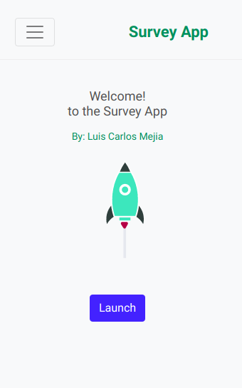
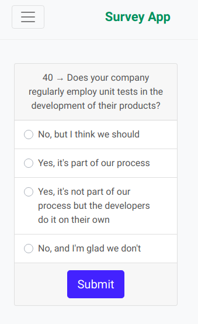
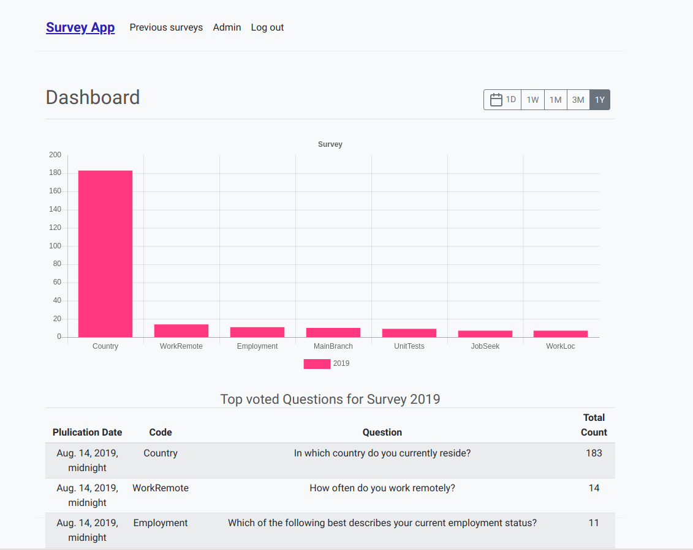
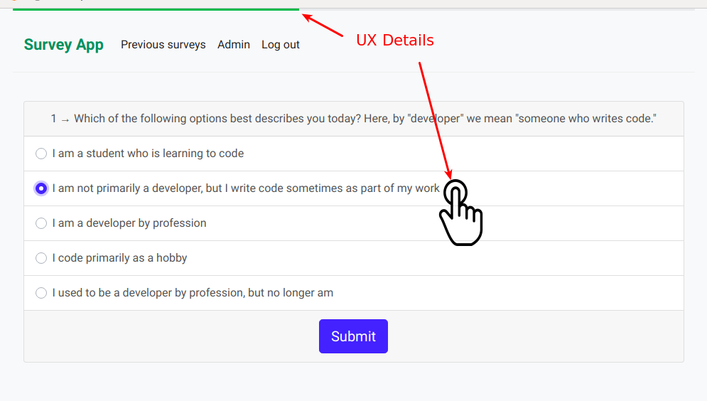
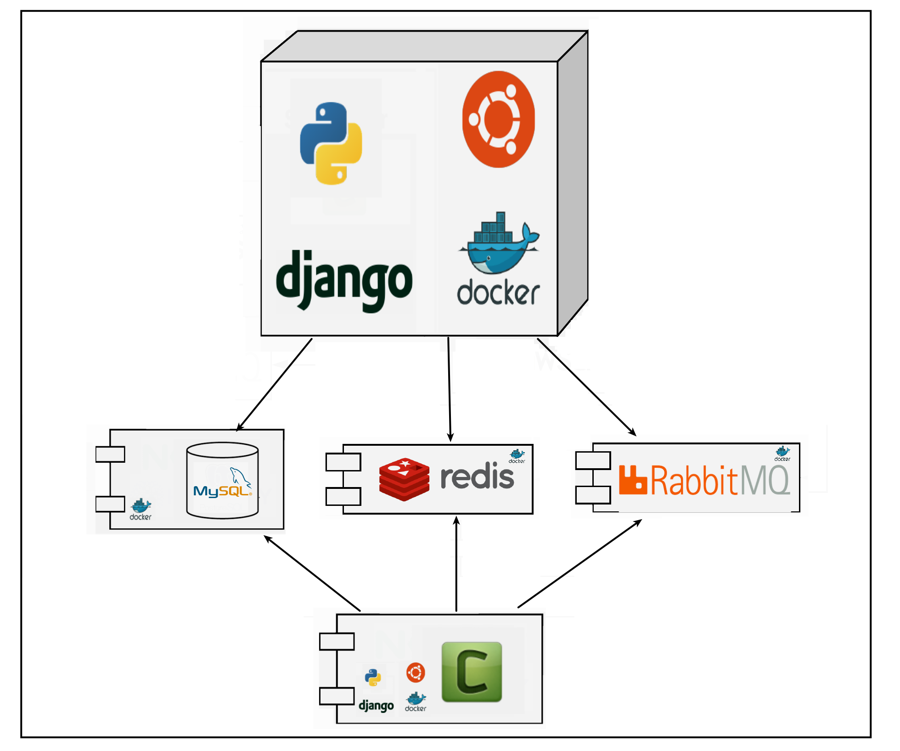

## Django Survey App

[Live Demo](http://luismejia.dev/)


|  Landing             |  Survey Form  |
| :-------------------------:|:-------------------------:|
  |  


This project is mobile browser friendly was created with [django](https://www.djangoproject.com/) and docker-compose.


## Run the project

You can run the app by running `docker-compose up`. It will live-reload while developing.

```
docker-compose up
```

## Questions in this Survey App

This App will present Questions and Choices from the * Stack Overflow Annual Developer Survey 2019 *

And will shows you the result for the real survey

Data Source: https://insights.stackoverflow.com/survey

there are 88,883 User Choices

I used pandas to load data from zip files and stored them in the database.

The app allows the admin to enter survey questions with multiple choice answers.

When a guest visits the app in a browser, it presents a random survey question to the guest and allow them to answer.

Record answers and display the survey in charts for for logged in users results in an admin interface.

The app avoids showing a previously answered question to the same guest.


## Charts


I use Django Admin tools bar to present dashboards in the admin, and based on their templates, I added two extra dashboards, a Chart Dashboard and a Table dashboard.



## UX Details that matter



### Label click

RadioButtons are tiny in nature, and they can be hard to click or tap. To enlarge the target area, the Survey App let users select an option by clicking or tapping not just that small square, but also the label or associated words.

### Progress Bar

**wouldn’t it be great if I know how much longer do I have to wait?**
Progress bars are made for such time-taking actions(as surveys). The thought behind it is: if a user knows the time a particular action will take, he will be prepared to wait for it. Or complete the activity in his free time. But he won’t be exasperated. Keeping the user experience intact.

## What can you find in this app?


This project use Docker-compose to start 5 containers:

* Django-App
* MySQL
* RabbitMQ
* Redis
* Celery





## Start Containers ##

```
docker-compose up

```


Loading Data
----------------

Load fixtures for Question, Choice, and UserChoice models:

```
python manage.py load_surveys_data

```

Running tests
----------------

```
python manage.py test --settings=settings.test

```


## Watch RabbitMQ Queues ##

```
docker exec -it survey-rabbitmq sh /var/lib/rabbitmq/watch-rabbitmq.sh
```


