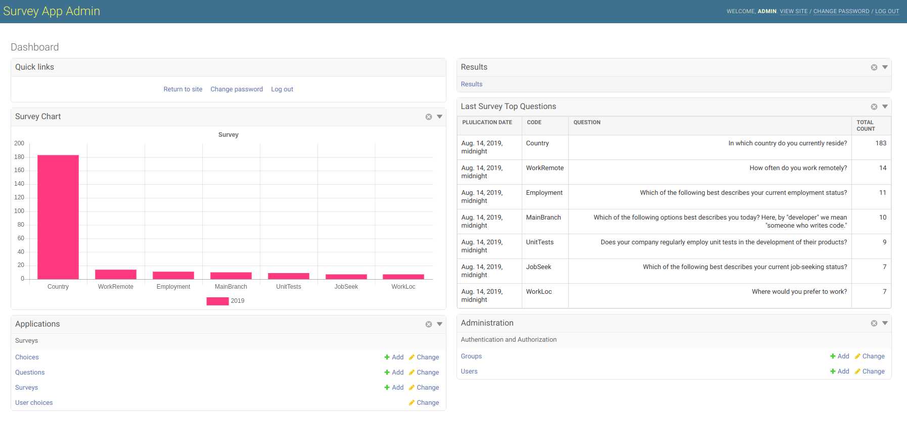

## Django Survey App

[working on Live Demo]()


|  Landing             |  Survey Form  |
| :-------------------------:|:-------------------------:|
  |  


This project is mobile browser friendly was created with [django](https://www.djangoproject.com/) and docker-compose.


## Run the project

You can run the app by running `docker-compose up`. It will live-reload while developing.

```
docker-compose up
```

## Questions in this Survey App

This App will present Questions and Choices from the * Stack Overflow Annual Developer Survey 2019 *

And will shows you the result for the real survey

Data Source: https://insights.stackoverflow.com/survey

there are 88,883 User Choices

I used pandas to load data from zip files and stored them in the database.

The app allows the admin to enter survey questions with multiple choice answers.

When a guest visits the app in a browser, it presents a random survey question to the guest and allow them to answer.

Record answers and display the survey in charts for for logged in users results in an admin interface.

The app avoids showing a previously answered question to the same guest.


## Charts



I use Django Admin tools bar to present dashboards in the admin, and based on their templates, I added two extra dashboards, a Chart Dashboard and a Table dashboard.


## What can you find in this app?


This project use Docker-compose to start 4 containers:

* Django-App
* MySQL
* RabbitMQ
* Redis

## Start Containers ##

```
docker-compose up

```

## Setup database ##

```

```

## Watch RabbitMQ Queues ##

```
sudo docker exec -it app-rabbitmq sh /var/lib/rabbitmq/watch-rabbitmq.sh
```
